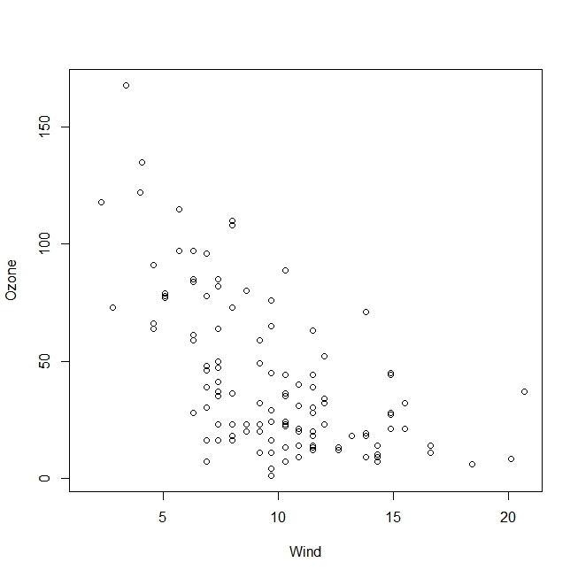
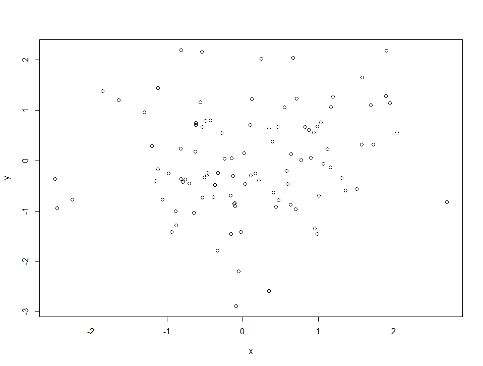

This lecture is about the base plotting system:

-   *graphics*: contains plotting functions for the "base" graphing
    systems, including **plot, hist, boxplot**

-   *grDevices*: containts the code implementing the various graphics
    devices including X11, PDF, PostScript, PNG, etc.

The lattice plotting system is implemented using:

-   *lattice*: contains code for producing Trellis graphics, includes
    functions like *xyplot, bwplot, levelplot*
-   *grid*: implements a different graphing system, the *lattice*
    package builds on top of *grid*; seldom this is used directly

The plot can be just view on the screen, sent to a file, viewed on a web
browser, etc. Also you have to establish if it is a chart that has to
dynamicly adjusts itself.

The first phase is initialising a plot The second phase is annotating a
plot

The base graphic plot has many parameters. These are documented in ?par

    library(datasets)
    hist(airquality$Ozone)

    library(datasets)
    with(airquality, plot(Wind, Ozone))

BoxPlot - note that Month needs to be Factor - categorical variable -
also I can put a label to the axes

    airquality <- transform(airquality, Month = factor(Month))
    boxplot(Ozone ~ Month, airquality, xlab = "Month", ylab = "Ozone (ppb)")

Key basic parameters
====================

-   **pch**: plotting symbol (default circle - char or letter)
-   **lty**: line type (solid, dotted)
-   **lwd**: line width
-   **col**: colour number, string or hex code
-   **xlab**: label for x axis
-   **ylab**: label for y axis

Important global parameters, can be specified in the par function are:

-   **las**: orientation of axis on the label
-   **bg**: background colour
-   **mar**: margin size
-   **oma**: outer margin size (default is 0 for all sides)
-   **mfrow**: number of plots per row on the screen device
-   **mfcol**: number of plots per columns on the screen devic

If you want to see which are the default values for these parameters you
do the following:

    par("lty")

    ## [1] "solid"

    par("col")

    ## [1] "black"

    par("mar")

    ## [1] 5.1 4.1 4.1 2.1

The above are the margins. They are 4 numbers starting from the botto,
left, top, right.

    x <- rnorm(100)
    hist(x)

Let's generate more data so that we can combine them

    y <- rnorm(100)
    plot(x, y)

Label and shape of the points are the default. We can adjust the margins

    par(mar = rep(2, times = 4))
    plot(x,y)

We lost the labels so we want to adjust things so that labels are there

    par(mar = c(4, 4, 2, 2))
    plot(x,y)

