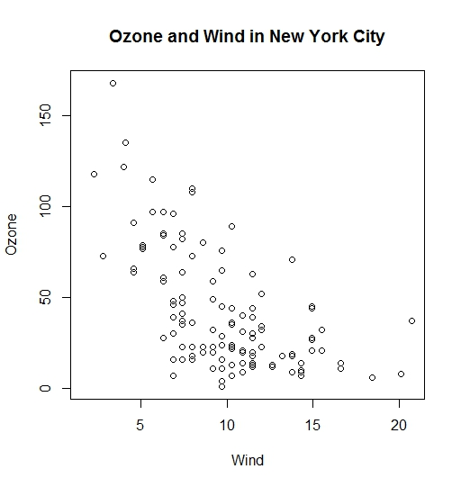
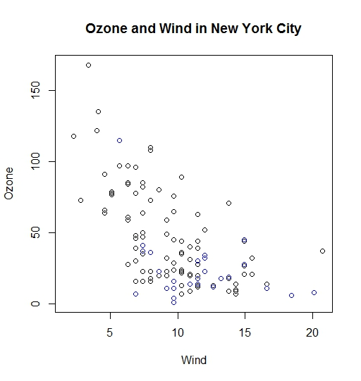
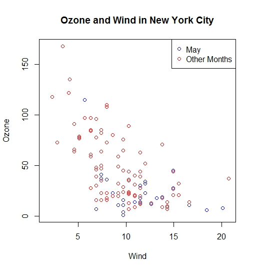
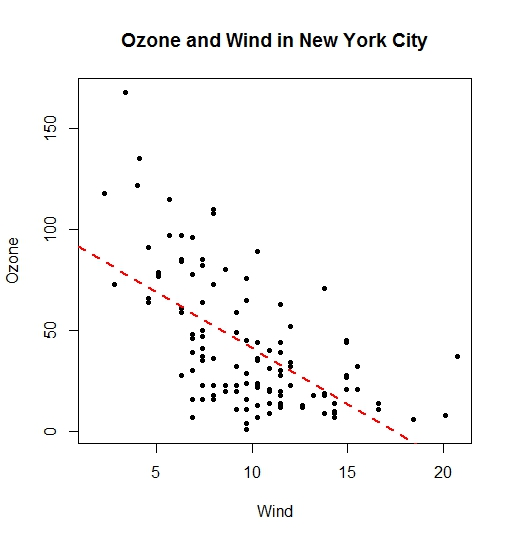
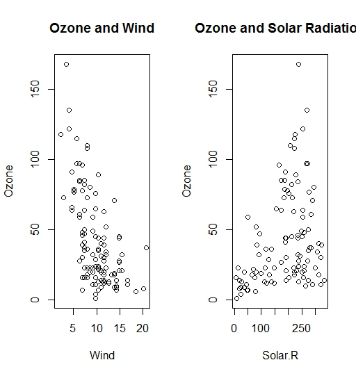
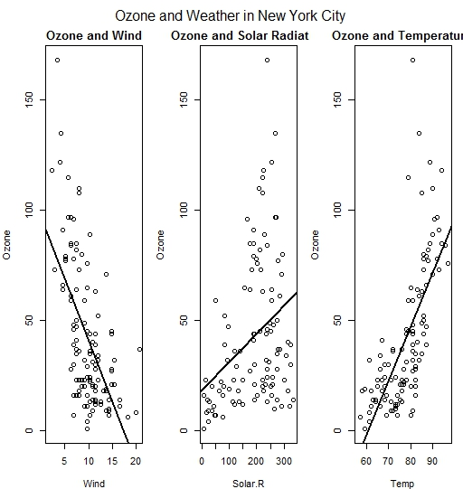
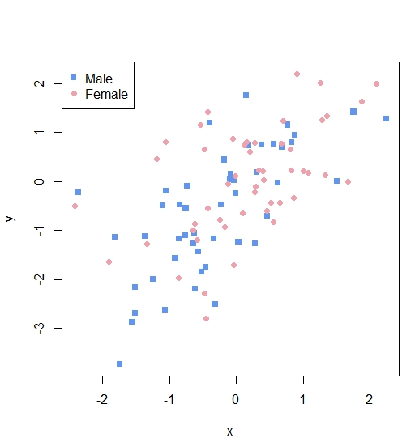

Base Plotting Functions
-----------------------

-   **plot**: make a scatter plot
-   **lines**: add lines to a plot
-   **points**: add points to a plot
-   **text**: add text labels specifying x,y coord
-   **title**: add annotations to x, y, labels, title, subtitle, margin
-   **mtext**: add arbitrary text to margins (in or out) of the plot
-   **axis**: adding axis ticks/labels

<!-- -->

    library(datasets)
    with(airquality, plot(Wind, Ozone))
    title(main = "Ozone and Wind in New York City")

The title can be added in the call to plot. Also we can subset on the
fly our dataset. Data points for May are in blue

    with(airquality, plot(Wind, Ozone, main = "Ozone and Wind in New York City"))
    with(subset(airquality, Month == 5), points(Wind, Ozone, col = "blue"))

We can subset more. In the above plot points were overwritten. If we
want to avoid that we can use the argument type = "n". This will setup
the plot without actually plotting anything

    with(airquality, plot(Wind, Ozone, main = "Ozone and Wind in New York City", type = "n"))
    with(subset(airquality, Month == 5), points(Wind, Ozone, col = "blue"))
    with(subset(airquality, Month != 5), points(Wind, Ozone, col = "red"))
    legend("topright", pch = 1, col = c("blue", "red"), legend = c("May", "Other Months"))

We can use regression lines or smoother we can do it as below. pch = 20
is the small black filled circle, lwd is the ticknes:

    with(airquality, plot(Wind, Ozone, main = "Ozone and Wind in New York City", pch = 20))
    model <- lm(Ozone ~ Wind, airquality)
    abline(model, lwd = 2)

We can do multiple plots on a single device:

    par(mfrow = c(1,2))
    with(airquality, {
      plot(Wind, Ozone, main = "Ozone and Wind")
      plot(Solar.R, Ozone, main = "Ozone and Solar Radiation")
    })

You can have an overall title and you do like like in the below. In
order to actually do you make first space for the title increasing the
outside margin (oma) that by default is 0, you increase the top margin
and you decrease the margin from default a little bit

    par(mfrow = c(1,3), mar = c(4, 4, 2, 1), oma = c(0, 0, 2, 0))
    with(airquality,{
      plot(Wind, Ozone, main = "Ozone and Wind")
      model1 <- lm(Ozone ~ Wind, airquality)
      abline(model1, lwd = 2)
      plot(Solar.R, Ozone, main = "Ozone and Solar Radiation")
      model2 <- lm(Ozone ~ Solar.R, airquality)
      abline(model2, lwd = 2)
      plot(Temp, Ozone, main = "Ozone and Temperature")
      model3 <- lm(Ozone ~ Temp, airquality)
      abline(model3, lwd = 2)
      mtext("Ozone and Weather in New York City", outer = TRUE)
    })

Let's just review the plot composition when we want to plot one part at
the time. We will use some random data that we will generate:

    x <- rnorm(100)
    y <- x + rnorm(100)
    g <- gl(2, 50, labels = c("Male", "Female"))
    str(g)

    ##  Factor w/ 2 levels "Male","Female": 1 1 1 1 1 1 1 1 1 1 ...

    plot(x, y, type = "n")
    points(x[g == "Male"], y[g == "Male"], col = "cornflowerblue", pch = 15)
    points(x[g == "Female"], y[g == "Female"], col = "lightpink2", pch = 19)
    legend("topleft", 
           pch = c(15, 19), 
           col = c("cornflowerblue", "lightpink2"), 
           legend = c("Male", "Female"))

