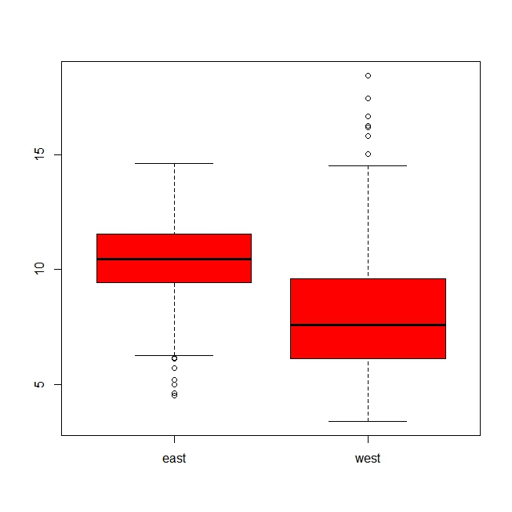
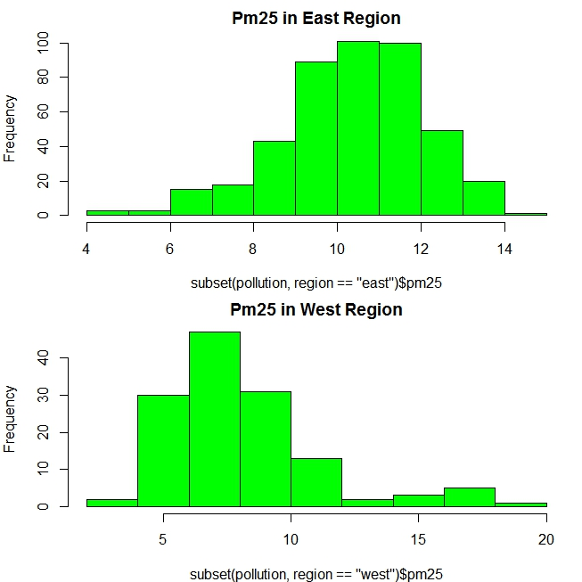
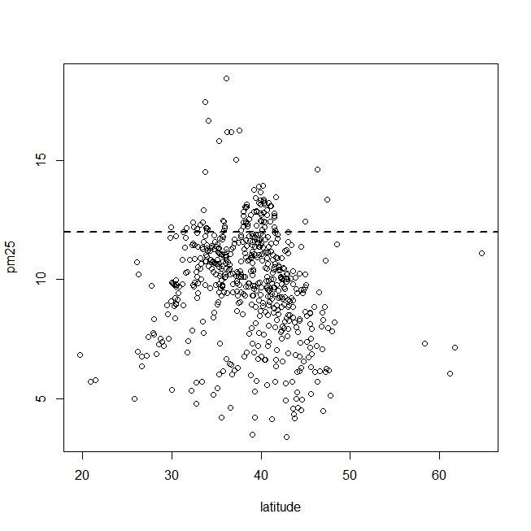
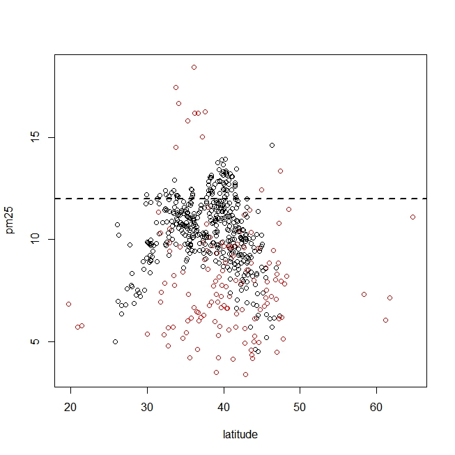
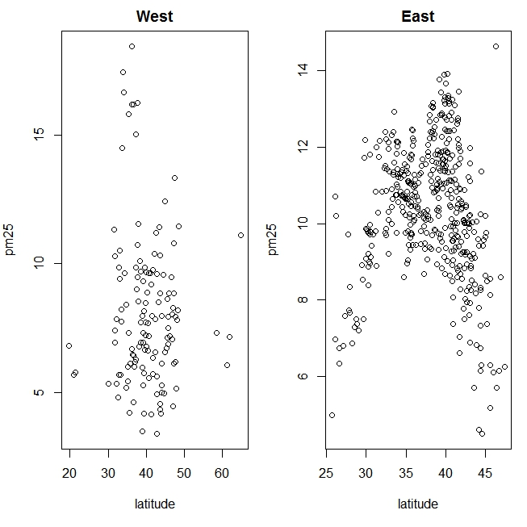
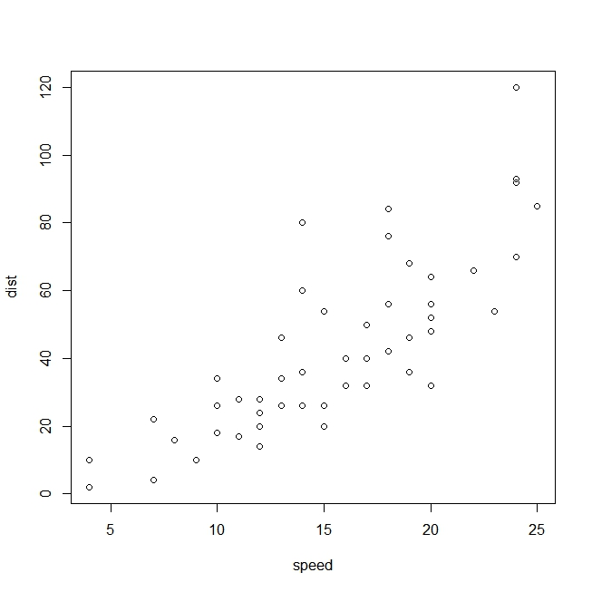
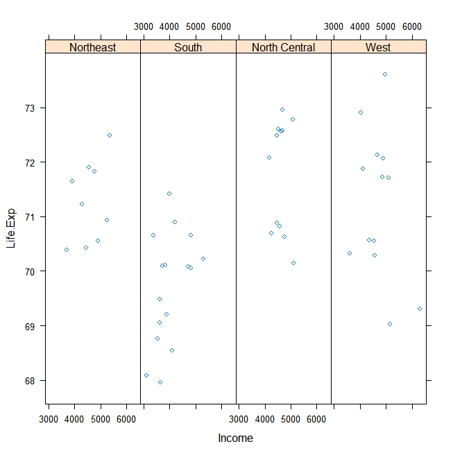
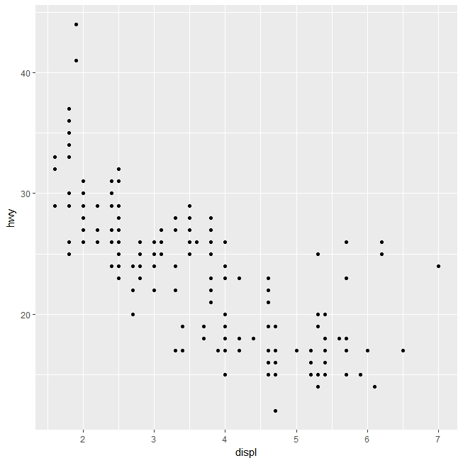

Charting many variables
-----------------------

This lecture tells how you can make plots in R to represent many
variables

    boxplot(pm25 ~ region, data = pollution, col = "red")

Same thing can be done with histograms

    par(mfrow = c(2, 1), mar = c(4, 4, 2, 1))
    hist(subset(pollution, region == "east")$pm25, col = "green", main = "Pm25 in East Region")
    hist(subset(pollution, region == "west")$pm25, col = "green", main = "Pm25 in West Region")

The most obvious thing is to plot the latitude. We can put the limit
with an horizontal line. We can see that in the highest latitude the
value of the pm25 is not that high

    with(pollution, plot(latitude, pm25))
    abline(h = 12, lwd = 2, lty = 2)

Colours can be used to add another dimension. Black is west and red is
east.

    with(pollution, plot(latitude, pm25, col = region))
    abline(h = 12, lwd = 2, lty = 2)

Another way to look at the same thing is to make 2 plots in the
following way

    par(mfrow = c(1, 2), mar = c(5, 4, 2, 1))
    with(subset(pollution, region == "west"), plot(latitude, pm25, main = "West"))
    with(subset(pollution, region == "east"), plot(latitude, pm25, main = "East"))

Plotting systems
================

Base Plotting system Artist's palette model - you have a blank canvass
and you add things to it. You place different pieces one-by-one. Good
when you are at the beginning when you do not know how things are. Use
the plot function and then annotation (text, lines). It is convenient
and intuitive. It is difficult to translate to others a plot created.
Plot is a series of R commands.

Base Plot
---------

    library(datasets)
    data(cars)
    with(cars, plot(speed, dist))

You can add title, lines, colors etc.

Lattice system
--------------

Implemented in the lattice package. Plot is constructed with 1 call
(xyplot, bwplot). The entire plot is created at once so you need to
specify a lot of info. It is useful for: \* conditioning types of plots:
looking at how y changes with x across levels of z \* things like
margins/spacing set automatically \* good for putting many many plots on
a screen

Downside: \* awkward to specify the entire plot in ona call \* you
cannot add something to the plot, you need to re-do all \* annotations
are tricky - not intuitive

    library(lattice)
    state <- data.frame(state.x77, region = state.region)
    xyplot(Life.Exp ~ Income | region, data = state, layout = c(4,1))

Very simple to costruct

ggplot2 System
==============

-   Comes from the graphic grammar
-   Well grounded system
-   Splits the difference between base and lattice in many ways
-   Automatically deals with spacings, text, titles
-   Superficial similarity to lattice but easier/more intuitive
-   Defaults can be customized

<!-- -->

    library(ggplot2)
    data(mpg)
    qplot(displ, hwy, data = mpg)

