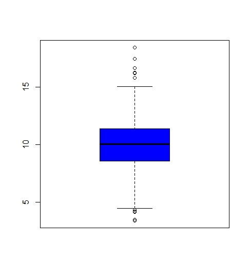
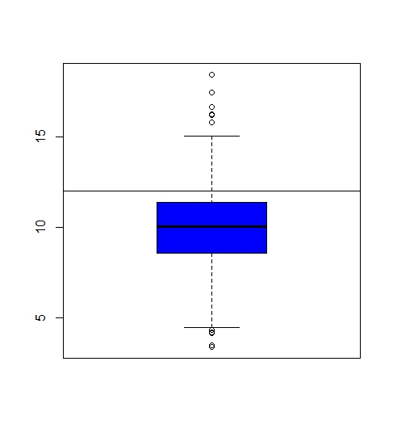
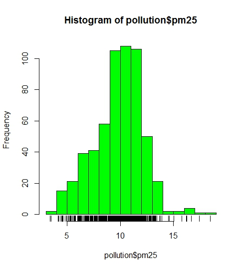
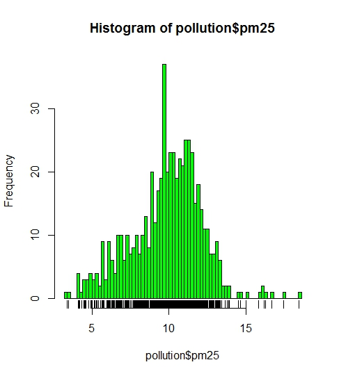
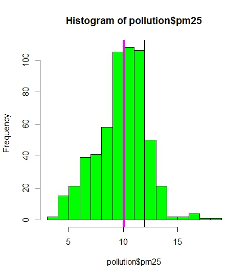
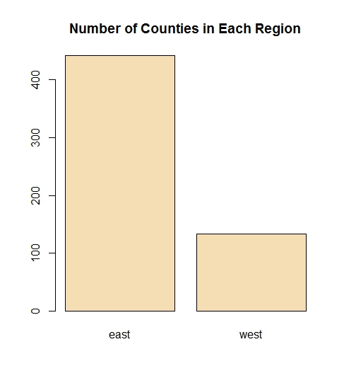

Data Input
----------

    pollution <- read.csv(f,
                          colClasses = c("numeric",
                                         "character",
                                         "factor",
                                         "numeric",
                                         "numeric"))
    head(pollution)

    ##        pm25 fips region longitude latitude
    ## 1  9.771185 1003   east -87.74826 30.59278
    ## 2  9.993817 1027   east -85.84286 33.26581
    ## 3 10.688618 1033   east -87.72596 34.73148
    ## 4 11.337424 1049   east -85.79892 34.45913
    ## 5 12.119764 1055   east -86.03212 34.01860
    ## 6 10.827805 1069   east -85.35039 31.18973

EDA - Exploratory graphs
------------------------

Thgis lecture is about very quick charts that can be done using R. The
point of exploratory graphs is:

-   To understand data properties
-   To find patters in data
-   To suggest modeling strategies
-   To "debug" analyses
-   To communicate results

Boxplot
-------

    boxplot(pollution$pm25, col = "blue")

Histogram
---------

    hist(pollution$pm25, col = "green")
    rug(pollution$pm25)

Change the breaks
=================

You play around with the breaks to have the number of bars you like
===================================================================

    hist(pollution$pm25, col = "green", breaks = 100)
    rug(pollution$pm25)

Overlaying Features
===================

    boxplot(pollution$pm25, col = "blue")
    abline(h = 12)

Inserting lines
===============

    hist(pollution$pm25, col = "green")
    abline(v = 12, lwd = 2)
    abline(v = median(pollution$pm25), col = "magenta", lwd = 4)

Barplot
-------

To summarise a cathegorical variable
====================================

    barplot(table(pollution$region), col = "wheat", main = "Number of Counties in Each Region")

